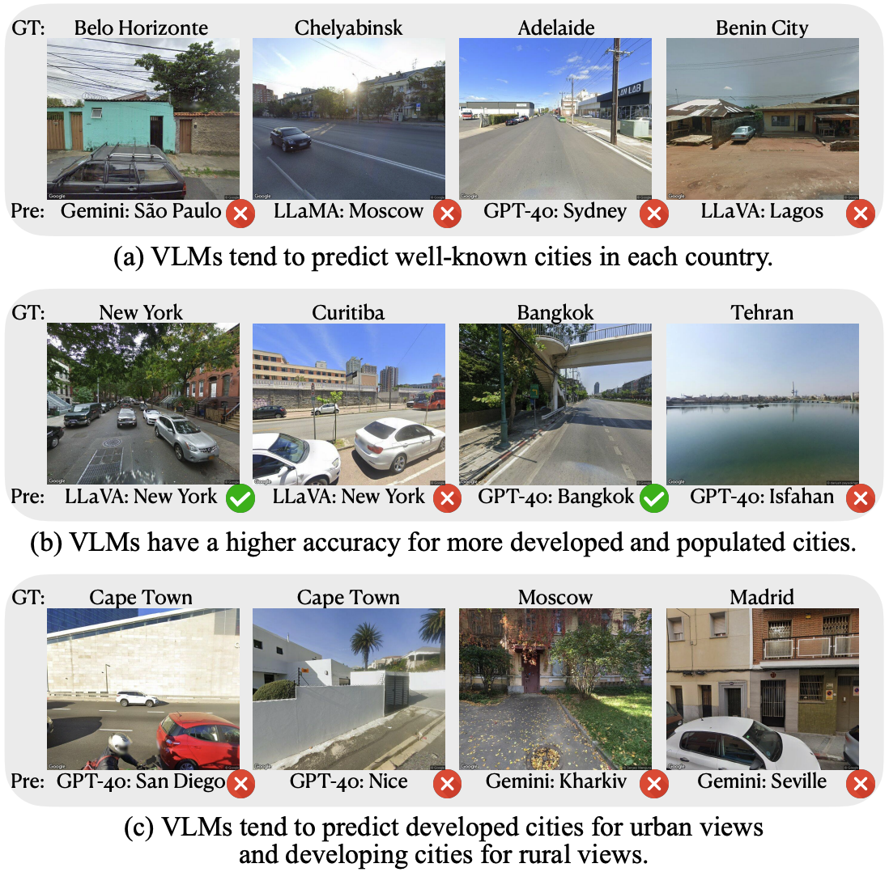

<div align= "center">
    <h1> 🔍🤖FairLocator</h1>
</div>

<div align="center">

</div>

</div>

<div align="center">

</div>
  
## ***VLMs as GeoGuessr Masters***

## UPDATES

[Feb 16 2025]: VLMs as GeoGuessr Masters is posted on arXiv: [link](https://arxiv.org/abs/2502.11163)


## 🏆 Leaderboard
✨An example result on depth:
| Models  |   | Avg. | Australia | Brazil | India | Nigeria | Russia | USA |
|---------|---|------|-----------|--------|-------|---------|--------|-----|
| **GPT-4o** | Cont. | ***94.4*** | 88.3 | 96.7 | ***99.3*** | 95.0 | ***88.7*** | 98.3 |
|           | Ctry. | ***90.7*** | 88.0 | 94.7 | ***97.0*** | ***81.3*** | ***86.0*** | 97.3 |
|           | City  | ***40.4*** | 45.0 | ***47.7*** | 47.0 | ***22.0*** | ***23.7*** | 57.0 |
|           | St.   | ***0.6***  | ***2.7***  | 0.3   | 0.3   | 0.0   | ***0.3***  | 0.0  |
| **Gemini** | Cont. | ***94.4*** | ***91.0*** | ***98.7*** | 97.7 | ***98.0*** | 81.0 | ***100.0*** |
|           | Ctry. | 86.2 | ***91.0*** | ***96.0*** | 92.3 | 77.7 | 60.3 | ***100.0*** |
|           | City  | 35.4 | ***54.3*** | 21.0  | ***49.3*** | 14.7  | 15.3  | ***57.7*** |
|           | St.   | 0.4  | 1.7   | 0.0   | 0.3   | 0.0   | 0.0   | ***0.3*** |
| **LLaMA**  | Cont. | 86.1 | 79.3 | 77.7  | 95.0  | 83.3  | 83.3  | 98.0  |
|           | Ctry. | 75.4 | 77.7 | 71.0  | 93.3  | 38.3  | 76.7  | 95.3  |
|           | City  | 21.8 | 24.3 | 9.0   | 37.3  | 3.0   | 14.3  | 43.0  |
|           | St.   | 0.2  | 1.0   | 0.0   | 0.0   | 0.0   | 0.0   | 0.0   |
| **LLaVA**  | Cont. | 34.0 | 3.3   | 38.7  | 39.0  | 39.0  | 32.7  | 51.3  |
|           | Ctry. | 24.8 | 3.3   | 19.0  | 35.0  | 30.3  | 12.0  | 49.0  |
|           | City  | 3.0  | 0.7   | 1.3   | 5.0   | 3.0   | 1.7   | 6.3   |
|           | St.   | 0.0  | 0.0   | 0.0   | 0.0   | 0.0   | 0.0   | 0.0   |
| **Avg.**   | Cont. | 77.2 | 65.5  | 77.9  | 82.8  | 78.8  | 71.4  | 86.9  |
|           | Ctry. | 69.3 | 65.0  | 70.2  | 79.4  | 56.9  | 58.8  | 85.4  |
|           | City  | 25.2 | 31.1  | 19.7  | 34.7  | 10.7  | 13.8  | 41.0  |
|           | St.   | 0.3  | 1.3   | 0.1   | 0.2   | 0.0   | 0.1   | 0.1   |

**Note:** Highest scores are marked in **bold** and *italic*.


## 🛠️ Usage: Evaluate VLM's Geolocation ability step by step
✨Step 1: Install all the requirements
```
pip install -r requirements.txt
```
✨Step 2: Query VLM By locations

```
python Query.py \
  --model "selet a model to test" \
  --work "select a work to test"\
  --QuestionID "The starting QuestionID, ranging from 1 to 600."\

  --GPT4o_API_KEY "openai_api_key"\
  --GoogleMap_API_KEY "googlemap_api_key"\

  --Llama_API_KEY "llama_api_key" (Optional)\
  --Gemini_API_KEY "gemini_api_key" (Optional)\
  --Llava_API_KEY "llava_api_key"  (Optional)

```

✨An example run for step 2:
```
python Query.py \
  --model GPT4o \
  --work Breadth.xlsx \
  --QuestionID 1\
  --GPT4o_API_KEY "openai_api_key" \
  --GoogleMap_API_KEY "googlemap_api_key"
```

✨Step 3: Save query results into excel file:

```
python TurnQueryResultIntoExcel.py \
  --model "selet a model to test" \
  --work "select a work to test"
```

✨Step 4: Evaluate Query Result By GPT4o:
```
python UsingGPTtoEvaluate.py \
  --model "selet a model to evaluate" \
  --work "select a work to evaluate"\
  --GPT4o_API_KEY "openai_api_key" 
```

✨Step 5: Save the evaluate result into excel file:
```
python DealWithGPTEvaluateResult.py \
  --model "selet a model to evaluate" \
  --work "select a work to evaluate"
```

✨Step 6: Get Response Cities' Coordinates:
```
python GetAnswerLatlon.py \
  --model <model_name> \
  --work <excel_file> \
  --api_key <googlemap_api_key>
```
✨Step 7: Calculate the Distance:
```
python CalculateDistance.py \
  --model <model_name> \
  --work <excel_file>
```
✨Step 8: Check the Evaluate Result from excel file <{model}_{work_name}EvaluateResult_with_Distance.xlsx>:


## 🔧 Argument Specification
1. `--model`: Select the model you want to test. You  can select it from ['GPT4o', 'Gemini', "Llama", 'Llava'].

2. `--work`: Select the model you want to test. You  can select it from ['Breadth.xlsx', 'Depth.xlsx'].

3. `--QuestionID`: Select the starting number you want to test. For most cases, it should be 1.
   
4. `--GPT4o_API_KEY`: Your API KEY. You can get it from the official website of OpenAI.

5. `--GoogleMap_API_KEY`: Your API KEY. You can get it from the official website of Google Map.

6. `--Llama_API_KEY`: Your API KEY. You can get it from the official website of Deepinfra.

7. `--Gemini_API_KEY`: Your API KEY. You can get it from the official website of Gemini.

8. `--Llava_API_KEY`: Your API KEY. You can get it from the official website of Replicate.


## 🔧 Source Data Specification

1. It includes multiple excel files.
   
2. Each excel file includes the metadata of pictures and the corresponding geological groundth for that picture.

3. For depth.xlsx and breadth.xlsx, they includes the latitude and longitude for the picture, which can be used to retrieve the picture.

   
## 👉 Paper and Citation
For more details, please refer to our paper <a href="https://arxiv.org/abs/2502.11163">here</a>.

If you find our paper&tool interesting and useful, please feel free to give us a star and cite us through:
```
@article{huang2025vlms,
  title={VLMs as GeoGuessr Masters: Exceptional Performance, Hidden Biases, and Privacy Risks},
  author={Huang, Jingyuan and Huang, Jen-tse and Liu, Ziyi and Liu, Xiaoyuan and Wang, Wenxuan and Zhao, Jieyu},
  journal={arXiv preprint arXiv:2502.11163},
  year={2025}
}
```
